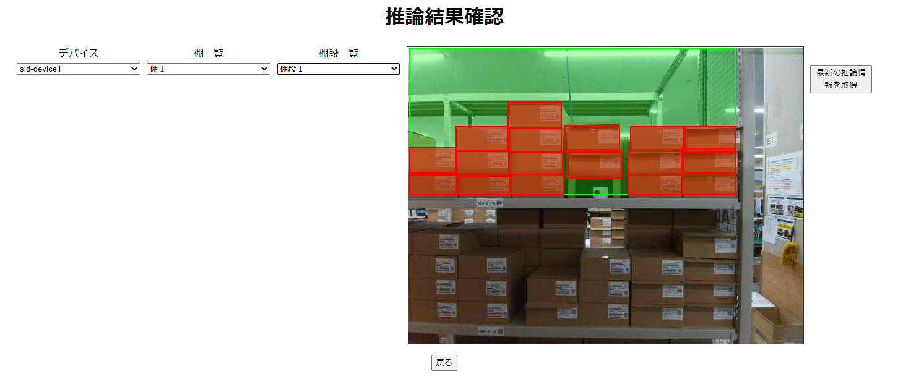

# Object Occupancy Rate: Sample Application on AITRIOS

## Contents <!-- omit in toc -->
- [Contents](#aitrios-application_object-occupancy-rate)
  - [Overview](#overview)
  - [Restrictions](#restrictions)
  - [Getting Started](#getting-started)
    - [Start application](#start-application)
      - [Start application on Github Codespaces](#start-application-on-github-codespaces)
      - [Start application on local Docker environment(DevContainer)](#start-application-on-local-docker-environmentdevcontainer)
  - [Documentation](#documentation)
    - [Functional Specifications](#functional-specifications)
  - [Get support](#get-support)
  - [See also](#see-also)
  - [Trademark](#trademark)
  - [Versioning](#versioning)
  - [Branch](#branch)
  - [Security](#security)

## Overview
This repository provides sample code for application that calculates the occupancy rate of objects using ["**aitrios-sdk-cloud-app-sample-ts**"](https://github.com/SonySemiconductorSolutions/aitrios-sdk-cloud-app-sample-ts).<br>



## Restrictions
- Following required software you need to install in your system

  - Node.js version 16.x.x (Confirmed it functions with version 16.20.2)

  For installation please refer the following link:

  https://nodejs.org/en/download/

- In the `AITRIOS connect mode` of this application, only the image data of the last 1 hour is acquired. Therefore, when using this mode, **please make sure that the device is either in the process of uploading image and inference result or has the data has been uploaded in the past 1 hour**.

## Getting Started
For basic Edge Device and Console operation, please refer to the [**Device Setup Guide**](https://developer.aitrios.sony-semicon.com/en/edge-ai-sensing/documents/device-setup-guide/) and [**Console User Manual**](https://developer.aitrios.sony-semicon.com/en/edge-ai-sensing/documents/console-user-manual/).

### Start application

#### Start application on Github Codespaces

1. Clone or fork this application in your GitHub environment.
2. Click the `+` button to create a codespace on the GitHub environment. See [how to create a codespace](https://docs.github.com/en/codespaces/developing-in-codespaces/creating-a-codespace-for-a-repository).
3. Create console access setting configuration file with real values in [src/common/console_access_settings.yaml](./src/common/console_access_settings.yaml).

    `src/common/console_access_settings.yaml`

    ```yaml
    console_access_settings:
        console_endpoint: "__console_endpoint__"
        portal_authorization_endpoint: "__portal_authorization_endpoint__"
        client_secret: "__client_secret__"
        client_id: "__client_id__"
    ```

    > **Note**
    >
    > - Specify the base URL
    > - Specify the token URL
    > - Specify registered application secret for client_secret
    > - Specify registered application client ID for client_id
    >
    > To obtain the endpoint URL, see [REST API Authentication](https://developer.aitrios.sony-semicon.com/en/file/download/edge-ai-sensing-portal-console-end-point-info/), or
    see the [Portal user manual](https://developer.aitrios.sony-semicon.com/en/edge-ai-sensing/documents/portal-user-manual/) for more details.

4. Run the sample application using the following command.
   ```
    $ npm run dev
    ```
6. Access the host address from the pop-up in the lower right corner, and verify that the application is running.

    > **Note**
    >
    > When checking the operation in `AITRIOS connect mode`, make sure that the inference upload is running on the device where the AI model and EdgeApp is deployed.

#### Start application on local Docker environment(DevContainer)

1. Open the cloned repository from VSCode's "Open Folder" in "File" tab
2. Open Command Palette in VSCode(Ctrl + Shift + P)
3. Type and choose `"Dev Containers: Open Folder in Container..."`
4. Select root directory of the project and wait for building DevContainer.

    ```sh
    /your/local/workspace/aitrios-application_object-occupancy-rate
    ```

5. Create console access setting configuration file with real values in [src/common/console_access_settings.yaml](./src/common/console_access_settings.yaml).
6. Run the sample application using the following command.
   ```
    $ npm run dev
    ```
8. Access the host address from the pop-up in the lower right corner, and verify that the application is running.

    > **Note**
    >
    > When checking the operation in `AITRIOS connect mode`, make sure that the inference upload is running on the device where the AI model and EdgeApp is deployed.

## Documentation
### Functional Specifications
- ["**Cloud SDK Sample Application TypeScript IDE Functional Specifications**"](./docs/development-docs/CloudSDK_FuncSpec_SampleApp_TypeScript_IDE.adoc)
- ["**Cloud SDK Sample Application TypeScript Functional Specifications**"](./docs/development-docs/CloudSDK_FuncSpec_SampleApp_TypeScript.adoc)

## Get support
- About the AI model, Edge App and command parameter file for this application :
  -   Contact SSS member (Logistics Team) via the following query: ["Inquiry Form - Input"](https://support.aitrios.sony-semicon.com/hc/en-us/requests/new)
- The others
  -   ["Contact Us"](https://support.aitrios.sony-semicon.com/hc/en-us/requests/new)

## See also
- [aitrios-sdk-cloud-app-sample-ts](https://github.com/SonySemiconductorSolutions/aitrios-sdk-cloud-app-sample-ts/tree/main)
- [aitrios-sdk-console-access-lib-ts](https://github.com/SonySemiconductorSolutions/aitrios-sdk-console-access-lib-ts)
- ["**Developer Site**"](https://developer.aitrios.sony-semicon.com/en/edge-ai-sensing/)

## Trademark
- ["**Read This First**"](https://developer.aitrios.sony-semicon.com/en/edge-ai-sensing/documents/read-this-first)

## Versioning

This repository aims to adhere to Semantic Versioning 2.0.0.

## Branch

See the "**Release Note**" from [**Releases**] for this repository.

Each release is generated in the main branch. Pre-releases are generated in the develop branch. Releases will not be provided by other branches.

## Security
Before using Codespaces, please read the Site Policy of GitHub and understand the usage conditions. 
