# **Document**

## **概要**

本アプリケーションは、

- [aitrios-sdk-cloud-app-sample-ts](https://github.com/SonySemiconductorSolutions/aitrios-sdk-cloud-app-sample-ts)

　を元に、

- [aitrios-sdk-console-access-lib-ts](https://github.com/SonySemiconductorSolutions/aitrios-sdk-console-access-lib-ts)

を利用して物体の占有率を算出するアプリケーションのサンプルです。

## **使用ライブラリ**

- next

- react

- react-dom

- consoleAccessLibrary

- axios

- flatbuffers

- paper.js

## **サンプルアプリケーションリポジトリ構成**

aitrios-sdk-cloud-occupancy-sample-app

<pre>

├── src (1)
│   ├── @types
│   │   └── global.d.ts (2)
│　 ├── common
│   │   ├── config.ts (3)
│   │   └── console_access_settings_sample.yaml
│   ├── hooks
│   │   ├── OverlaySpinner.tsx
│   │   ├── ToggleSwitchButton.tsx
│   │   └── useInterval.js (4)
│   ├── pages
│   │   ├── allOccupapncy.tsx (5)
│   │   ├── deviceInference.tsx (6)
│   │   ├── deviceRange.tsx (7)
│   │   ├── deviceRelation.tsx (8)
│   │   ├── drawerMng.tsx (9)
│   │   ├── inferenseSettings.tsx (10)
│   │   ├── shelfMng.tsx (11)
│   │   ├── shelfOccupancy.tsx (12)
│   │   ├── topPage.tsx (13)
│   │   ├── index.tsx (14)
│   │   ├── _app.tsx (15)
│   │   └── api
│   │       ├── getDeviceData.ts (16)
│   │       ├── getDeviceImage.ts (17)
│   │       ├── getDeviceInference.ts (18)
│   │       ├── getDeviceRange.ts (19)
│   │       ├── getDeviceRelationList.ts (20)
│   │       ├── getDrawerList.ts (21)
│   │       ├── getInferenceSettings.ts (22)
│   │       ├── getShelfList.ts (23)
│   │       ├── putDeviceRange.ts (24)
│   │       ├── putDeviceRelationList.ts (25)
│   │       ├── putDrawerList.ts (26)
│   │       ├── putInferenceSettings.ts (27)
│   │       ├── putShelfList.ts (28)
│   │       └── readModeSettings.ts 
│   ├── util
│   │   ├── analyzeInference.ts (29)
│   │   ├── deserialize.ts (30)
│   │   └── ObjectdetectionGenerated.ts (31)
│   ├── styles (32)
│   │   ├── allOccupancy.module.css
│   │   ├── deviceInference.module.css
│   │   ├── deviceRange.module.css
│   │   ├── deviceRelation.module.css
│   │   ├── drawerMng.module.css
│   │   ├── globals.css
│   │   ├── inferenceSettings.module.css
│   │   ├── overlaySpinner.module.css
│   │   ├── shelfMng.module.css
│   │   ├── shelfOccupancy.module.css
│   │   └── topPage.module.css
│   ├── public
│   │   ├── deviceData (33)
│   │   │   ├── deviceData_example.json
│   │   │   └── deviceData.json
│   │   ├── deviceImage (34)
│   │   ├── deviceInference (35)
│   │   ├── deviceRange (36)
│   │   │   ├── deviceRange_example.json
│   │   │   └── deviceRange.json
│   │   ├── deviceRelation (37)
│   │   │   ├── deviceRelation_example.json
│   │   │   └── deviceRelation.json
│   │   ├── drawerList (38)
│   │   │   ├── drawerList_example.json
│   │   │   └── drawerList.json
│   │   ├── settings (39)
│   │   │   └── settings.json
│   │   └── shelfList (40)
│   │       ├── shelfList_example.json
│   │       └── shelfList.json
│   ├── next.config.js
│   ├── next-env.d.ts
│   └── tsconfig.json
└── tsconfig.jest.json

</pre>

1)  src: サンプルアプリケーション格納フォルダ

2)  global.d.ts: 共通データ構造定義ファイル

3)  config.ts : Consoleへの接続情報を設定するファイル

4)  useInterval.js: インターバルロジック

5)  allOccupapncy.tsx: 全棚占有率表示のフロントエンドUI

6)  deviceInference.tsx: 推論結果表示のフロントエンドUI

7)  deviceRange.tsx: デバイス(カメラ)の判定範囲設定のフロントエンドUI

8)  deviceRelation.tsx: デバイス(カメラ)と棚段の関連付け設定のフロントエンドUI

9)  drawerMng.tsx: 棚への棚段登録設定のフロントエンドUI

10) inferenseSettings.tsx: サンプルアプリケーション設定のフロントエンドUI

11) shelfMng.tsx: 棚登録設定のフロントエンドUI

12) shelfOccupancy.tsx: 棚単位の占有率表示のフロントエンドUI

13) topPage.tsx: トップページ表示のフロントエンドUI

14) index.tsx: サンプルアプリケーションのフロントエンドUI

15) \_app.tsx: サンプルアプリケーションのフロントエンド初期化

16) getDeviceData.ts: デバイス情報取得ロジック

17) getDeviceImage.ts: 推論画像取得ロジック

18) getDeviceInference.ts: 推論結果取得ロジック

19) getDeviceRange.ts: デバイスの判定範囲設定読込ロジック

20) getDeviceRelationList.ts: デバイスと棚段の関連付け設定読込ロジック

21) getDrawerList.ts: 棚への棚段登録設定読込ロジック

22) getInferenceSettings.ts: サンプルアプリケーション設定読込ロジック

23) getShelfList.ts: 棚登録設定読込ロジック

24) putDeviceRange.ts: デバイスの判定範囲設定保存ロジック

25) putDeviceRelationList.ts: デバイスと棚段の関連付け設定保存ロジック

26) putDrawerList.ts: 棚への棚段登録設定保存ロジック

27) putInferenceSettings.ts: サンプルアプリケーション設定保存ロジック

28) putShelfList.ts: 棚登録設定保存ロジック

29) analyzeInference.ts: 推論結果変換ロジック

30) deserialize.ts: 推論結果デコードロジック

31) ObjectdetectionGenerated.ts: Deserialize用ソースコード

32) 各フロントエンドスタイルシート格納ディレクトリ

33) deviceData: ConsoleAccessLibrary(getDevices)動作用の取得データ格納ディレクトリ

34) deviceImage: ConsoleAccessLibrary(getImages)動作用の取得データ格納ディレクトリ

35) deviceInference: ConsoleAccessLibrary(GetInferenceResults)動作用の取得データ格納ディレクトリ

36) deviceRange.json: 判定範囲設定保存ファイル

37) deviceRelation.json: デバイスと棚段の関連付け設定保存ファイル

38) drawerList.json: 棚への棚段登録設定保存ファイル

39) settings.json: サンプルアプリケーション設定保存ファイル

40) shelfList: 棚登録設定保存ファイル

## **サンプルアプリケーションの画面構成**

 本アプリケーションは、下記の８つの画面で構成されています。
 
 各画面はアプリケーションのメニュー画面から選択することで切り替え可能です。

| 画面             | 使用用途                                                                                             |
|------------------|------------------------------------------------------------------------------------------------------|
| 棚登録           | 棚を登録します                                                                                       |
| 棚段登録         | 棚に棚段を登録します                                                                                 |
| デバイス登録     | デバイスに棚、棚段を登録します                                                               |
| カメラ範囲登録   | デバイス、棚、棚段毎に占有率の判定範囲を登録します                                                   |
| 占有率(棚)表示   | 指定した棚内の棚段毎の占有率を表示します。カメラ範囲登録で範囲登録を行った棚段のみを表示対象とします |
| 占有率(全体)表示 | 全棚毎の占有率を表示します。カメラ範囲登録で範囲登録を行った棚のみを表示対象とします                 |
| 推論結果表示     | カメラ範囲登録で範囲登録を行ったデバイス、棚、棚段に対し、検出した物体の矩形を表示します             |
| 設定             | アプリケーションの設定を行います                                                                     |

## **サンプルアプリケーションの機能**

### **棚登録**

占有率測定対象の棚を登録/削除する機能。

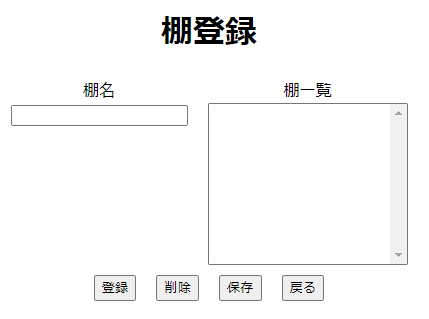

- 棚名　　　：登録する棚名を入力する

- 棚一覧　　：登録された棚の一覧を表示する

- 登録ボタン：棚名エディットボックスに入力した棚名を登録する

- 削除ボタン：棚一覧で選択した棚名を削除する

- 保存ボタン：棚一覧に登録されている棚を保存する

- 戻るボタン：メニューに戻る

### **棚段登録**

占有率測定対象の棚段を棚に登録/削除する機能。

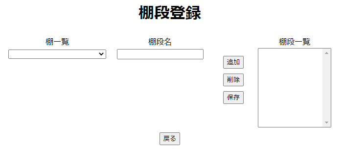

- 棚一覧　　：棚登録で登録した棚の一覧が表示される

- 棚段名　　：登録する棚段名を入力する

- 棚段一覧　：棚一覧で選択された棚に登録された棚段の一覧を表示する

- 追加ボタン：棚一覧で選択された棚に棚段を登録する

- 削除ボタン：棚段一覧で選択された棚段を削除する

- 保存ボタン：棚段一覧を保存する

- 戻るボタン：メニューに戻る

### **デバイス登録**

デバイス(カメラ)に棚段との関連を登録/削除する機能。

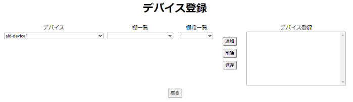

- デバイス　　：コンソールに登録されているデバイスの一覧を表示する

- 棚一覧　　　：棚段登録で棚段が登録された棚の一覧を表示する

- 棚段一覧　　：棚段登録で登録された棚段の一覧を表示する

- デバイス登録：デバイスに登録された棚、棚段を表示する

- 追加ボタン　：デバイスに棚、棚段を追加する

- 削除ボタン　：デバイス登録で選択した棚、棚段を削除する

- 保存ボタン　：デバイスと棚、棚段を保存する

- 戻るボタン　：メニューに戻る

### **カメラ範囲登録**

棚段にデバイス画像から占有率測定範囲を登録/削除する機能。

カメラの範囲は、マウスボタン押下地点からマウスボタンを離す地点までの矩形を範囲とする。

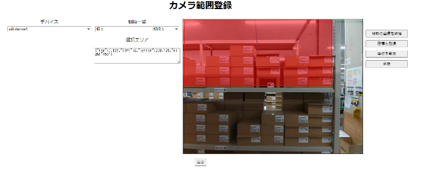

- デバイス　　　　　　　：デバイス登録で棚、棚段が登録されているデバイスの一覧を表示する

- 棚段一覧　　　　　　　：デバイス登録で登録された棚、棚段を表示する

- 画像　　　　　　　　　：デバイスの推論画像を表示する

- 最新の画像を取得ボタン：コンソールから最新の推論画像を取得し、表示する

- 座標を登録ボタン　　　：デバイス、棚、棚段に選択した範囲を占有率判定範囲として登録する

- 座標を削除ボタン　　　：デバイス、棚、棚段に登録された占有率判定範囲を削除する

- 保存ボタン　　　　　　：デバイス、棚、棚段に登録された占有率判定範囲を保存する

- 戻るボタン　　　　　　：メニューに戻る

### **占有率(棚)表示**

棚内の棚段毎に占有率を測定、表示する機能。

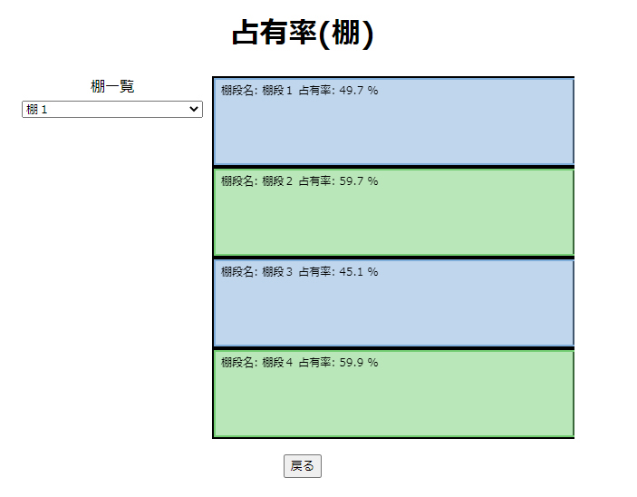

- デバイス　：カメラ範囲登録で判定範囲が登録されている棚の一覧を表示する

- 図形　　　：棚段毎の占有率を表示する

- 戻るボタン：メニューに戻る

### **占有率(全体)表示**

棚毎の占有率を測定、表示する機能。

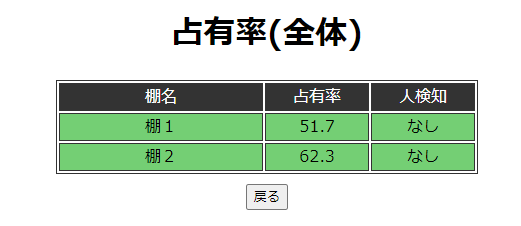

- 棚名　　　：カメラ範囲登録で判定範囲が登録されている棚の一覧を表示する

- 占有率　　：棚全体での占有率を表示する

- 戻るボタン：メニューに戻る

### **推論結果表示**

占有率測定範囲内の推論結果の矩形を表示する機能。

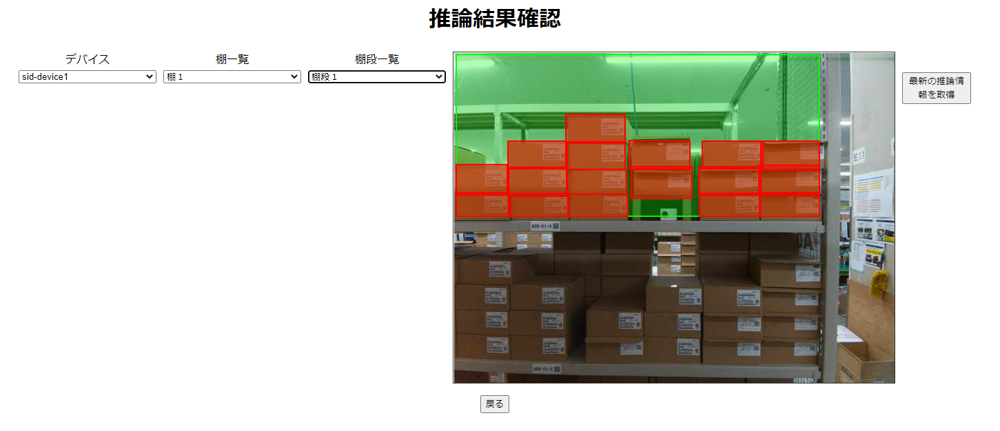

- デバイス　　：カメラ範囲登録で判定範囲が登録されているデバイスの一覧を表示する

- 棚一覧　　　：カメラ範囲登録で判定範囲が登録されている棚の一覧を表示する

- 棚段一覧　　：カメラ範囲登録で判定範囲が登録されている棚段の一覧を表示する

- 画像　　　　：デバイスで選択されているデバイスの推論画像、カメラ判定範囲、物体を検知した矩形を表示する

    - 緑の枠：カメラ判定範囲
    - 赤の枠：カメラ範囲内の物体を検知した矩形

- 戻るボタン　：メニューに戻る

### **設定**

アプリケーションの設定を行う機能。

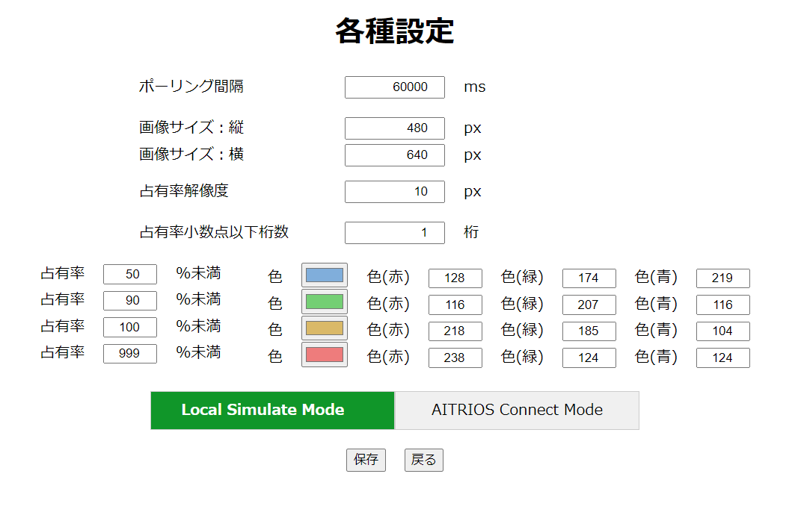

- ポーリング間隔　　　：推論結果を取得する間隔

- 画像サイズ：縦　　　：占有率を算出する時に利用する画像サイズ

- 画像サイズ：横　　　：占有率を算出する時に利用する画像サイズ

- 占有率解像度　　　　：占有率を算出する時に何px単位で判定を行うかの設定値

- 占有率小数点以下桁数：占有率表示時の小数点以下桁数

- 占有率　　　　　　　：占有率の閾値

- 色　　　　　　　　　：各占有率を表示する時の色指定

- Local Simulate Mode             ：Localの画像・メタデータを使うモード

- AITRIOS Connect Mode：AITRIOSから画像・メタデータを取得するモード
　

## **サンプルアプリケーションの設定値**

本サンプルアプリケーションを動作させるにあたり、以下のパラメータについて設定を可能としている。

1.  ポーリング間隔：推論情報を取得するポーリング間隔。

2.  画像サイズ：縦：推論結果画像の縦サイズ。
    - 表示には実際の画像サイズを利用するが、推論結果から占有率を計算する時の画像サイズを取得出来ないため、設定値にて登録しておく。

3.  画像サイズ：横：推論結果画像の横サイズ。
    - 表示には実際の画像サイズを利用するが、推論結果から占有率を計算する時の画像サイズを取得出来ないため、設定値にて登録しておく。

4.  占有率解像度：占有率を計算する際の、画像の解像度。
    - 推論結果から占有率を計算する時にpixel単位で画像内の物体の有無を計算しているが、使用メモリが多くなる場合を想定し、解像度を設定可能としている。

5.  占有率小数点以下桁数：占有率を表示する時の小数点以下桁数。

6.  占有率(%未満)：占有率の閾値(4つまで指定可能)。

7.  色：占有率毎の表示色(4つまで指定可能)。

## **物体占有率算出方法**

本サンプルアプリケーションでは以下仕様にて占有率を算出している。

1.  **デバイス毎の推論結果を取得**

ConsoleAccessLibraryの「getInferenceResults」を利用し、デバイス毎の推論結果を取得する。

2.  **デバイス毎の推論結果をデコードする**

「deserialize」、「analyzeInference」を利用し、推論結果から座標を抽出する。

3.  **推論結果の座標が、デバイス、棚段毎の判定範囲に存在するか判定する**

推論結果の座標とデバイス・棚段毎の判定範囲が重複する座標のtop, left, bottom, rightの座標を算出する。

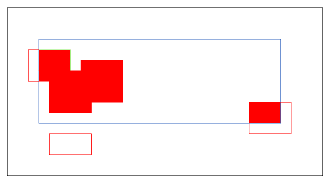

　　　黒枠：画像サイズ

　　　青枠：判定範囲

　　　赤枠：推論結果の座標から算出した矩形

　　　赤塗りつぶし：占有率算出に利用する範囲

4.  **推論結果から占有率を計算するための面積を算出し、占有率を算出する**

画像サイズの縦横を設定値「占有率解像度」で割った配列を「0」初期化で作成し、算出した座標の範囲内に該当する配列の要素に対して「1」を設定する。

判定範囲に該当する面積と、配列で「1」が立っている面積を算出し占有率を算出する。

(赤塗りつぶしの要素数 / 青枠の要素数)

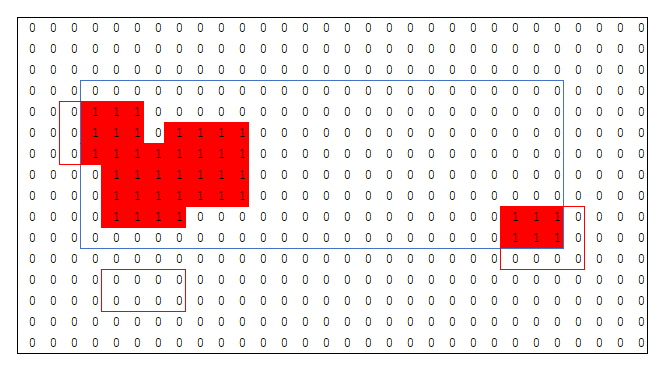

　　　黒枠：画像サイズ

　　　青枠：判定範囲

　　　赤枠：推論結果の座標から算出した矩形

　　　赤塗りつぶし：占有率算出に利用する範囲

5.  **人を検知した場合の処理について**

占有率計算途中に人を検知した場合、人を検知したデバイス内の棚・棚段の占有率は通常通り算出するが、棚段・棚の占有率に対し人を検知したことを表示する。

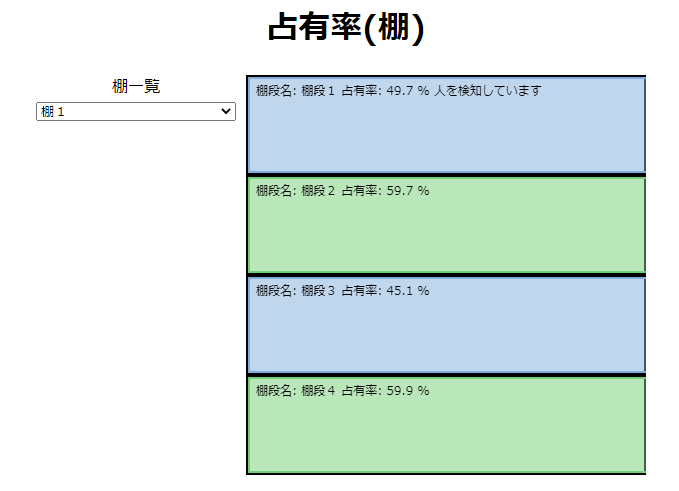

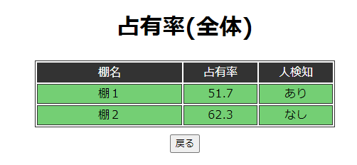

6.  **推論結果が取得できない場合の処理について**

棚段に登録したデバイスの推論結果が取得できない場合、棚段の占有率は算出されず「-」を表示する。

棚を構成する階段のうち、1つでも占有率が算出されない階段があった場合、棚の占有率は算出されず「-」を表示する。

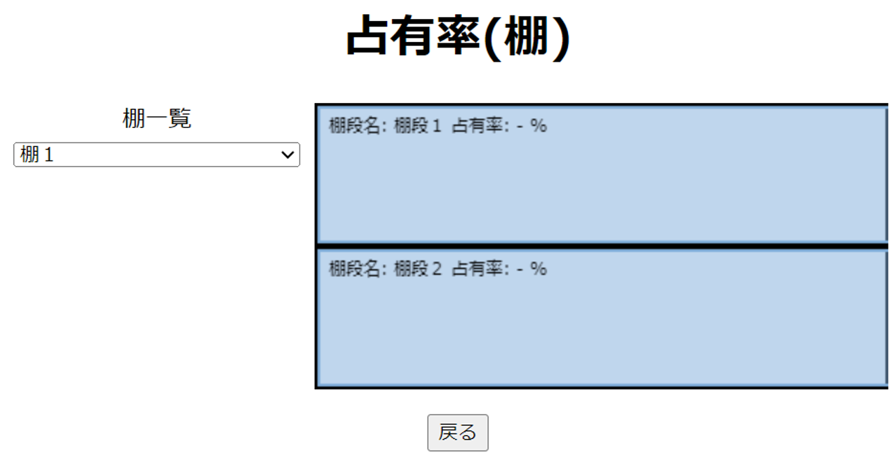

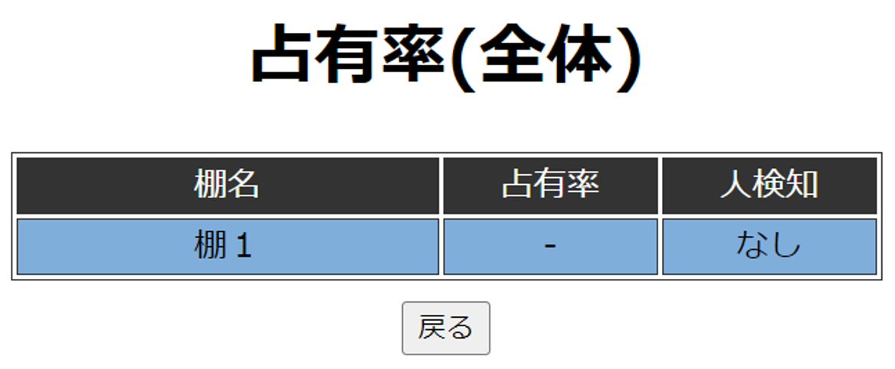
